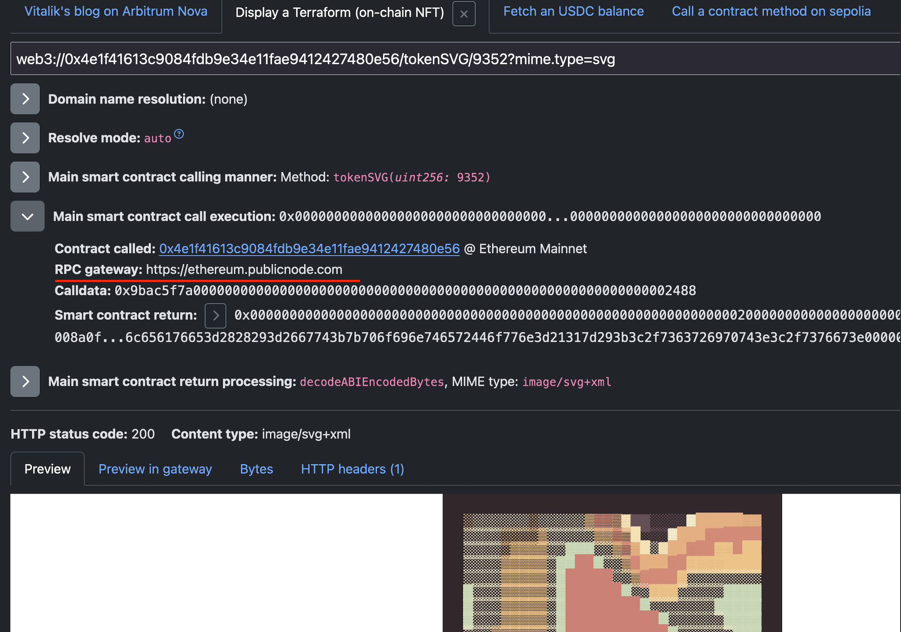
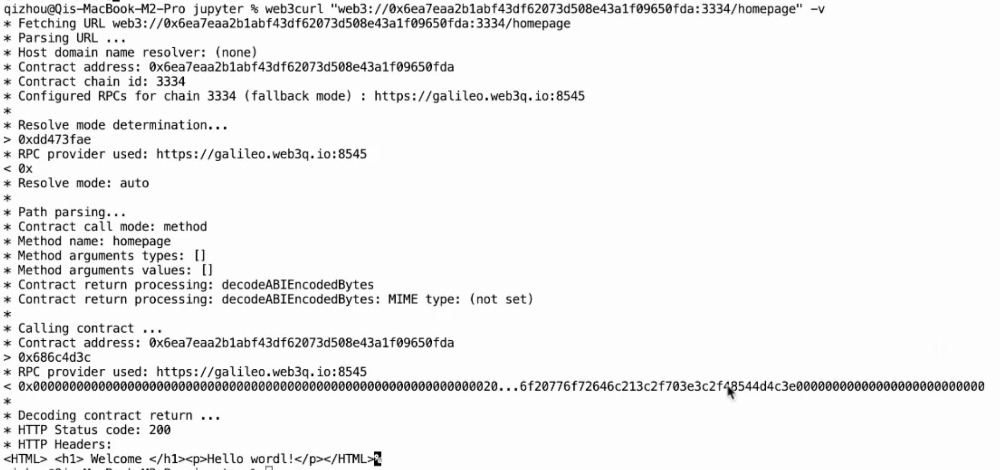
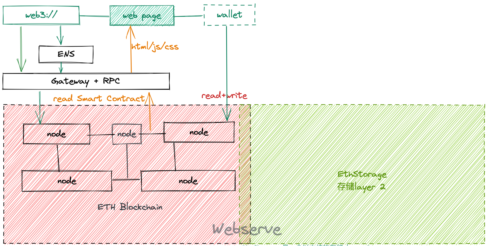
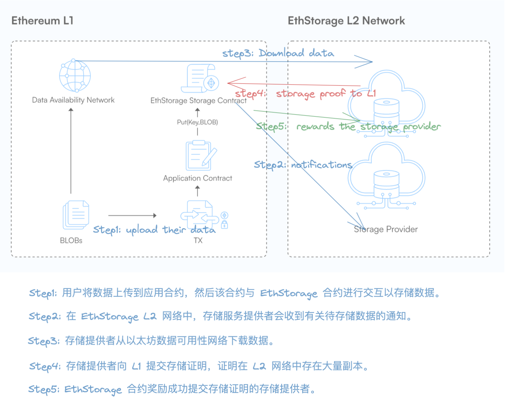

# Web3 URL 残酷共学第 1 期残酷指引

> ⚠️ 正式开始前请确保你在身体上和精神上都处于合适的状态，请刻意练习，残酷面对 🆒。为方便检索 The First Web3 URL Intensive CoLearning 简写为 WICL1st，第 2 期即为WICL2nd，第 3 期即为 WICL3rd，以此类推。

> ⚠️ 报名需要按要求认真填写下面 [ XXX ] 部分，方可通过报名审核，通过审核即可开始自主学习。

---

# [ Oscar ]

1. **自我介绍：**
   Oscar，a eco-lifelong learner，懂点技术的产品或运营角色。
   - 非常喜欢以开源的方式残酷共学，和更多的 LXer 学习交流。
   - 之前有深入学习过 Nostr 协议，想认真学一下以太坊里的 Web3:// 协议，了解协议背后设计的思路，及基于协议如何更好构建围绕 EVM 具体的生活 dApps。
   
2. **组队期待：**
   预计参与：产品设计，写 PRD ，配合 coding，具体 idea 还在构建中，和聊的来的小伙伴看看做一个有意思的基于 Web3:// 的实用项目，Just do it。
   
3. **你认为你会完成本次 Web3 URL 的残酷学习吗？**
   100%

---

## 第 1 期共学时间计划

- **7 月 8 日 - 7 月 14 日**：

  - 自我介绍：大家按要求更新上方自我介绍，方面大家互相了解，及后续自由组队方向。
  -  [Web3 URL 残酷共学频道](https://t.me/LXDAO/8748)报道：大家可以自由在残酷共学群里交流分享，互动答疑，根据自身学习阶段情况随时开启自由组队。
  - 课前学习：了解残酷共学流程，GitHub 协作共学基础；Web3:// 协议课前学习。

- **7 月 15 日 - 7 月 21 日**：

  - **7 月 15 日 周一晚 8 点- 9 点（北京时间）：** 第 1 次公开课分享
  - **本周共学内容：** 涉及 Web3://  的背景和演进历史；支持 Web3://  协议的访问方式 (gateway 和 EVM browser)来浏览以太坊上面的数据；熟悉使用 Web3://  和 EthStorage 早期测试网来部署简单的去中心化网站。
  - **Homework1：** 见[课程 PPT](https://docs.google.com/presentation/d/1egJUKJrjC9wjkmOF9sLBkTSwHpd6hl8FXkWehPW7kFk/edit#slide=id.g1754f50a55c_0_11)。

- **7 月 22 日 - 7 月 28 日**
  - **7 月 22 日 周一晚 8 点- 9 点（北京时间）：** 第 2 次公开课分享
  - **本周共学内容：** 涉及 Web3://  高级开发工具，包括：在命令行通过 web3curl 来通过 Web3://  协议下载数据，通过 ethfs-uploader 批量上传网页数据，通过 manual 模式来搭建去中心化多人交互全链网站；及深入理解以太坊的存储模型和 gas 开销等。
  - **边学边用实战开发：** 根据组队情况自由安排。
  - **Homework2：** 见[课程 PPT](https://docs.google.com/presentation/d/1egJUKJrjC9wjkmOF9sLBkTSwHpd6hl8FXkWehPW7kFk/edit#slide=id.g1754f50a55c_0_11)。

- **7 月 29 日 - 8 月 4 日**
  - **7 月 29 日 周一晚 8 点- 9 点（北京时间）：** 第 3 次公开课分享
  - **本周共学内容：** 涉及实际应用案例分享及未来以太坊基础设施在 Web3://  的重要作用及开发方向等。
  - **边学边用实战开发：** 根据组队情况自由安排。
  - **结营分享：** 具体时间及详情另在「Web3 URL 残酷共学频道」通知。

---

## 笔记证明 Notes Proof

<!-- Content_START --> 

### 07.15
- 今日学习时间：2 小时
- 学习内容小结：
  - Web3://  的[背景和历史](https://docs.web3url.io/vision/background)学习：尽管在协议层面向去中心化转变，但许多去中心化应用（dApps）仍依赖于中心化组件，如服务器或网络服务提供商（NSP）。
  - [解决方案](https://docs.web3url.io/vision/our-solution)旨在取代 Web2 集中化瓶颈：设计思路学习
    
    - 专用的以太坊侧链，支持 EVM 和高效的二进制大对象（BLOB）存储，将取代传统的客户端/服务器模型。
    - 采用 Web3 风格的 URL 标准，替代传统的 DNS/URL 方案。
    - 作为轻客户端的 Web 浏览器扩展，通过 web3 URL 执行 EVM 调用，将成为去中心化的 HTTP 。
  
- 第一次公开课部分
  - 对什么是 "web3://" 访问协议？Why  "web3://“？How to Use web3: //? How to Access EVM with web3:// ？ 有了初步的认识和理解。
  - 目前安装火狐浏览器下载了 [Firefox extension]( https://addons.mozilla.org/en-US/firefox/addon/web3url/) 进行体验，使用 Native browser support 体验，具体背后调用逻辑还待学习。
- Homework 部分 
  - 暂无

- Question and Ideas
  - 在想基于web3:// 哪些应用场景是当前最需要的或频率最高的？

### 07.16

- 今日学习时间：2 小时
- 学习内容小结：
  - 学习了解以太坊改进提案 [EIP-4804](https://eips.ethereum.org/EIPS/eip-4804) 和  [EIP-6860](https://eips.ethereum.org/EIPS/eip-6860)：
    - ERC-4804，也称为“Web3 URL到EVM调用消息转换”，旨在为以太坊网络定义一种新的 URL 类型的标准。
    -  EIP-6860，旨在为以太坊虚拟机（EVM）Base 4804 引入一个去中心化的呈现层。
    
  - 通过访问 `web3://cyberbrokers-meta.eth/renderBroker/5`跳转 https://cyberbrokers-meta.w3eth.io/renderBroker/5 学习了解背后数据是如何被调用及被呈现。
  
    - 根据请求的网络对象位置（如以太坊或其他区块链）将请求分发到不同的 Gateway
    - Gateway 通过调用 ENS 把 cyberbrokers 所映射的合约地址来去定位。🤔
  
      
  
  - 回顾 [公开课](https://www.youtube.com/watch?v=hmN77o-ex8I) 学习，尤其是 QA 环节。我们需要一个协议保证「去中心定位去中心化的资源」。一个是如何定位的问题，一个是如何访问的问题。
  
  - 对目前具体的 Application 方向进行了了解，面临一些具体问题：目前很多浏览器不兼容，存储费用过高等。
  
- Homework 部分 
  - 暂无
- Question and Ideas
  - 并不是所有的东西都需要去中心化，去中心和中心化如何平衡？

### 07.17

- 今日学习时间：1 小时
- 学习内容小结：
- Homework 部分 完成前 2 个
  - Find the ownership of an your favor NFT
    - 使用Firefox Extension访问：web3://moon-birds-xyz.eth/render/108
      - 跳转到：https://moon-birds-xyz.w3eth.io/render/108
        - web3-chain-id: 1
        - web3-cname: moon-birds-xyz.w3eth.io
        - web3-contract-address：0x56B9308EFd014f10423B42B3aDE7eeCFe128B1BD
          - ENS Name Tag：[web3url.eth](https://etherscan.io/address/0xbff45643d3af697a178ac671212e284a7f86cdae)
          - Contract Source Code (Solidity):  查看 render 方法
  - Find the balance of an account in an ERC-20 contract (USDC / USDT)
    - 使用Firefox Extension访问：web3://usdc.eth/balanceOf/vitalik.eth?returns=(uint256)
      - 跳转到：https://usdc.w3eth.io/balanceOf/vitalik.eth?returns=(uint256)
        - web3-chain-id：1
        - web3-cname：usdc.w3eth.io.
        - web3-contract-address：0xA0b86991c6218b36c1d19D4a2e9Eb0cE3606eB48
        - web3-host-domain-name-resolver：ens
        - web3-mode-auto-method：balanceOf
        - 


- Question and Ideas
  - token-address：`0x52284158e02425290f6b627aeb5fff65edf058ad` 和contract-address：`0x56B9308EFd014f10423B42B3aDE7eeCFe128B1BD` 之间的连接关系🤔

### 07.18

- 今日学习时间：1 小时
- 学习内容小结：
  - [WEB3:// URL STRUCTURE](https://docs.web3url.io/web3-url-structure/base) 协议的框架结构思路学习
    - Base structure
    - Standards
    - Domain name resolution
    - Resolve mode 解析模式定义了在不同环境下如何处理和解释 Web3 URL，以确保资源的正确定位和访问。

```html
node . -v 'web3://w3url.eth'
* Host domain name resolver: ens
*   Resolver address: 0xc0497E381f536Be9ce14B0dD3817cBcAe57d2F62  <!-- ENS解析的以太坊地址 -->
*   Resolver chain id: 1  <!-- 以太坊主网 -->
*   Resolver chain RPC: https://ethereum.publicnode.com <!-- 与以太坊主网交互的RPC端点 ?-->
*   Domain name being resolved: w3url.eth <!-- 解析的ENS域名 -->
*   Resolution type: contentContractTxt <!-- 解析类型 -->
*   contentcontract TXT record: w3q-g:0xEbcA4860ebBe969E9Bc42643fcb437879dBDa9C6
*   Result address: 0xEbcA4860ebBe969E9Bc42643fcb437879dBDa9C6
*   Result chain id: 3334
```

- Homework 
  - Deploy a contract in auto model and say "hello world" 自动模式
  - Deploy a contract in manual model and say "hello world" 手动模式

- Question and Ideas
  - Web3URL Chrome 插件使用研究 
    - https://github.com/Whitehare2023/web3url
    - https://github.com/ComfyGummy/chrome-web3

### 07.19

- 今日学习时间：1 小时
- 学习内容小结：
  - WEB3:// CLIENTS 学习了解
    - 三种方式：HTTPS gateways、EVM Browser、Chrome extension
    - Librairies：web3protocol-go、web3protocol-js
    - 两个 Debug 工具：[Web3:// Sandbox](https://w3-sandbox.eth.eth.w3link.io/) （这个比较直观） + Web3curl （单独安装）
      

  - 补充学习：
    - [IANA - Uniform Resource Identifier (URI) SCHEMES（统一资源标识符方案）](http://www.iana.org/assignments/uri-schemes)

    - URI （Uniform Resource Identifier，统一资源标识符）。URI 属于 URL 更高层次的抽象，一种字符串文本标准。就是说，URI 属于父类，而 URL 属于 URI 的子类。URL 是 URI 的一个子集。二者的区别在于，URI 表示请求服务器的路径，定义这么一个资源。而 URL 同时说明要如何访问这个资源（http://）。
    
      ```http
      ftp://ftp.is.co.za/rfc/rfc1808.txt (URL)
      http://www.ietf.org/rfc/rfc2396.txt (URL)
      ldap://[2001:db8::7]/c=GB?objectClass?one (URL)
      mailto:John.Doe@example.com (URL)
      news:comp.infosystems.www.servers.unix (URL)
      tel:+1-816-555-1212
      telnet://192.0.2.16:80/ (URL)
      urn:oasis:names:specification:docbook:dtd:xml:4.1.2
      ```
    
      ```http
      scheme://host[:port#]/path/.../[;url-params][?query-string][#anchor]
      scheme //有我们很熟悉的 http、https、ftp 以及著名的 ed2k，迅雷的 thunder 等。
      host //HTTP 服务器的IP地址或者域名
      port# //HTTP 服务器的默认端口是 80 (可省略)。如果使用了别的端口必须指明，例如     tomcat 的默认端口是 8080 http://localhost:8080/
      path //访问资源的路径
      url-params //所带参数
      query-string //发送给 http 服务器的数据
      anchor //锚点定位
      ```

- Homework 无
- Questions and Ideas
  - RPC gateway 是去中心化的吗？🤔

### 07.20

- 今日学习时间：1 小时
- 学习内容小结：
  - 学习用 [Solidity](https://soliditylang.org/) 简单编写合约，简单使用 [Remix IDE](http://remix.ethereum.org/) 部署合约。

- Homework 
  - 完成作业 3 ：Deploy a contract in auto mode and say "hello world"

    -  auto mode：The smart contract is generic and has not implemented a interface defined by the `web3://` protocol. In this case, we will craft the URL path in a specific way to indicate the name, arguments and return signature of the method we want to call on the contract.

      直接写方法即可，不用单独 Declare a smart contract as manual mode 。🤔

    ```solidity
    // SPDX-License-Identifier: MIT
    
    pragma solidity >=0.7.0 <0.9.0;
    contract HelloWeb3 {
        string public greeting = "Hello Web3! from Oscar";
        function getGreeting() public view returns (string memory) {
            return greeting;
        }
    }
    ```

  - 领取 W3Q 测试币：部署合约成功，[合约地址详情](https://explorer.galileo.web3q.io/tx/0x0c28db6ee94d92b82f9d7075e2bcfa562541e3af479ccf07802867bf0176e70f/internal-transactions)：0xc89bd91d4814b940a335d5f632dc3988782c7237

    
    
    ⚠️Galileo Testnet W3Q 的链 id 为3334，访问时需要指定``:3334``，auto mode 模式需要 指定``/getGreeting`` ，不然访问会失败。🤔
    
    ``web3://0xc89bd91d4814b940a335d5f632dc3988782c7237:3334/getGreeting``
    
    具体见下图：
    
    

### 07.21

- 今日学习时间：1 小时
- 学习内容小结：
  - ETHSTORAGE Networks ：了解学习 EthStorage sidechain is fully EVM-compatible, [Galileo Testnet](https://docs.web3url.io/ethstorage-information/networks) 设置。

  - EthStorage POA Explorer：https://explorer.galileo.web3q.io

  - ethereum-magicians.org：[EIP-4804: Web3 URL to EVM Call Message Translation](https://ethereum-magicians.org/t/eip-4804-web3-url-to-evm-call-message-translation/8300)
  
  - **[FlatDirectory](https://docs.web3url.io/advanced-topics/flatdirectory) ：** ERC-5018 提议的 FlatDirectory 是用于文件系统目录的标准接口，允许在基于 EVM 的区块链上的任何二进制对象被其他 dApp 重新使用。该标准允许在智能合约中实现文件系统目录的标准 API。该标准提供了基本功能，可以读取/写入任何大小的二进制对象，并且如果对象过大而无法在单个交易中处理，则允许进行对象的分块读写。
  
- Homework ：Deploy a contract in manual model and say "hello world" 

  - A `manual` resolve mode smart contract is designed for the `web3://` protocol. In this case, any path is valid, and the smart contract will usually returned some content for at least the root path. 

  ```solidity
  // SPDX-License-Identifier: MIT
  
  pragma solidity >=0.7.0 <0.9.0;
  
  contract HelloWeb3 {
      string public greeting = "Hello Web3! from Oscar";
      
      function resolveMode() external pure returns (bytes32) {
          return "manual";
      }
      function getGreeting() public view returns (string memory) {
          return greeting;
          }
      fallback(bytes calldata cdata) external returns (bytes memory) {
      // 检查路径是否为空或不以'/'开头：
          if (cdata.length == 0 || cdata[0] != 0x2f) {
              return bytes("");
          }
          // 仅包含 '/'
          if (cdata.length == 1) {
              return abi.encode(getGreeting());
          }
          return abi.encode("Not found");
      }
  }
  ```

  部署合约成功，[合约地址详情](https://explorer.galileo.web3q.io/tx/0x340be88ad1b319d9310c76d25ce1ec1bdf5b91e5be8b7a93e21d41b34145d28a/internal-transactions)：0x5f975e35433a95d83bc183f4bec22d2fa0619269

  ⚠️Galileo Testnet W3Q 的链 id 为3334，访问时需要指定``:3334``，在 manual mode 模式`` any path is valid`` 🤔。
  直接访问``web3://0x5f975e35433a95d83bc183f4bec22d2fa0619269:3334`` 正常。
  


### 07.22
- 今日学习时间：2 小时
- 学习内容小结：
  - [第二节公开课](https://www.youtube.com/watch?v=z207TQYNSdM)学习，后续看回放在具体实操
    
  - 基于 Web3:// 应用场景思考
    - Sample Applications 参考
      - Tutorial: https://tutorial.w3q.w3q-g.w3link.io/
      - W3NS: https://w3ns.w3q.w3q-g.w3link.io/
      - Blog platform: https://dblog.w3q.w3q-g.w3link.io/
      - W3Box: https://w3box.w3q.w3q-g.w3link.io/
      - W3Drive: https://w3drive.w3q.w3q-g.w3link.io/
      - W3Mail: https://w3mail.w3q.w3q-g.w3link.io/
      - QRobot: https://qrobot.w3q.w3q-g.w3link.io/
  
    - 天涯论坛、维基百科、GitHub、个人博客
    - 好玩的一个 Web3 网页🤔
    - 与 Nostr 网络结合 
  

### 07.23

- 今日学习时间：1 小时
- 学习内容小结：
  - 去中心化存储应用及 gas 开销了解
    - 下载的命令行工具 [web3curl](https://docs.web3url.io/web3-clients/web3curl) 通过 Web3://  协议下载数据了解学习
    - 批量上传工具 [ethfs-uploader](https://docs.web3url.io/tutorials-on-ethstorage-early-testnet/upload-your-first-file-folder-with-ethfs-uploader) 批量上传网页数据 了解学习
    - https://github.com/ethstorage/evm-large-storage/blob/master/contracts/examples/FlatDirectory.sol  待学习

  - Manual 模式搭建网站了解学习：

    -  https://github.com/ethstorage/web3url-website 为例学习去中心化全链网站，前端页面如何从合约渲染出来。


### 07.24

- 今日学习时间：1 小时
- 学习内容小结：
  - 去中心化留言墙 demo 熟悉
    - 合约[部署](https://explorer.galileo.web3q.io/tx/0x51c9d279e82b3e62e75a0aad357492b242882179a95c440089847e988b6fbe20/internal-transactions)：``0x236993aa25b16e2cadd73f64350a38d310bce596``
    - 合约访问：
      - auto 模式，gateway 方式查看：
        - ``web3://0x236993aa25b16e2cadd73f64350a38d310bce596:3334/homepage``
      - manual 模式：适合更复杂的交互
    - 合约交互：addPost()方法
    - 合约升级：比如新增“增删改查”功能，需要在升级模式对合约进行升级
      - 测试很重要：不然很耗 Gas 

    ```solidity
    // SPDX-License-Identifier: GPL-3.0
    
    pragma solidity >=0.8.2 <0.9.0;
    
    contract Wall{
        string[] posts;
        function addPost(string memory post) public {
            posts.push(post);
        }
        function getPosts() public view returns(string[] memory){
            return posts;
        }
    
        function homepage() public view returns(string memory){
            string memory page = "<HTML><h1> Welcome </h1>";
            
            for (uint256 i = 0; i < posts.length; i++) {
                page = string.concat(page, "<p>");
                page = string.concat(page, posts[i]);
                page = string.concat(page, "</p>");
            }
            page = string.concat(page, "</HTML>");
            return page;
        }
    }
    
    ```

    - web3curl 测试：结构熟悉

      

  - [ethfs-cli](https://github.com/ethstorage/ethfs-cli) 了解学习

    - 通过智能合约实现批量上传文件到以太坊存储
    - 修改了以太坊存储逻辑，激励机制
    - [FlatDirectory](https://docs.web3url.io/advanced-topics/flatdirectory) 路由实现了解
    - 架设自己网关？ 待学习

### 07.25

- 今日学习时间：1 小时
- 学习内容小结：
  - 结合自己理解画了一个 web3url 与智能合约交互图：不一定对

    - 

  - [Web3:// Talks](https://github.com/IntensiveCoLearning/Web3-URL/discussions/153) 项目构思，Web3Talks
    - **可能涉及的核心功能**：
      1. 声音录制与分享：简单点直接上传已录制好的声音
      2. 去中心化存储：Ethstorage 存储？
      3. 可视化音频图景：基于已有的声音文件基于某种算法进行构图呈现🤔
      4. 互动社交功能：未来
      5. 个性化推荐：未来
    - **用户体验**
      - 简洁直观的界面
      - 多语言支持
      - 功能明确：记录+呈现+互动🦋
      - 用户反馈机制：用户调查和反馈收集，优化参与体验和功能。
    - **技术方案**
      - **音频处理**：适合的音频编码和存储技术，优化数据压缩和存取效率。
      - **智能合约设计**：灵活可扩展的智能合约，支持多个音频文件调用，比如 50 个和 1000 个区别🤔。
      - **区块链/及存储选择**：未来基于项目需求，选择合适的链。


### 07.26

- 今日学习时间：1 小时
- 学习内容小结：

  - EthStorage：是一个模块化的去中心化存储二层，提供由数据可用性（DA）驱动的可编程键值存储。它为 Rollups 提供了长期的数据可用性（DA）解决方案，并为完全链上应用程序如游戏、社交网络、人工智能等开辟了新的可能性。
    - EIP-4844 引入了数据块，增强了像 Rollups 这样的二层扩展解决方案的吞吐量和效率。然而，这些数据块的数据只能暂时使用，意味着几周后会被丢弃。这产生了一个重要影响：二层无法无条件地从一层推导出最新状态。如果某一数据无法再从一层获取，Rollup 可能无法同步链。
    - 有了 EthStorage 作为长期数据可用性解决方案，二层随时可以从它们的数据可用性层（Ethereum DA, Celestia, EigenDA, etc. + EthStorage）推导出所需的信息。

  - 了解学习 [How EthStorage Works](https://docs.ethstorage.io/readme/how-ethstorage-works)

  


### 07.27

- 今日学习时间：1 小时
- 学习内容小结：

  - [Portal Network](https://github.com/ethereum/portal-network-specs) 了解学习
    - 由多个点对点网络组成，这些网络共同提供必要的数据和功能，以支持标准的 JSON-RPC API。这些网络特别设计主要目的是以确保 clients 在使用这些网络时能最小化「**网络带宽、CPU、RAM 和硬盘资源**」的消耗。🤔
  
    - 了解 [Shishui: Ethereum Portal Network Client written in Go](https://github.com/optimism-java/shisui)
  
  - https://w3url.w3eth.io/#/ 拆解
    - 源码学习了解 https://github.com/ethstorage/web3url-website  
  
    - VUE结构，基于 Web3:// + Web3Q Galileo 测试网实现
  
  - [Web3:// Talks](https://github.com/IntensiveCoLearning/Web3-URL/discussions/153) 项目改为 Web3:// Sounds
    - demo UI 设计思考中
    - 与 Derick 交流，他完成合约开发这块

### 07.28

- 今日学习时间：1 小时
- 学习内容小结：
  - [Web3:// Sounds](https://github.com/luffythink/Web3Sounds) 项目建设中
    - 产品简介
    - 产品团队
    - 产品进度
    - 产品功能框架
    - 产品用户旅程


### 07.29

- 今日学习时间：2 小时
- 学习内容小结：
  - [Web3:// Sounds](https://github.com/luffythink/Web3Sounds) 小组会议 idea demo 同频
    - 定位公共产品，永久记录工具
    - 音频文件存储费用和维护问题，谁上传谁具有删除权限
    - 产品原型图，前期 demo 化繁为简，目前涉及 3 个页面：首页、上传音频文件页面、用户中心页面
    - 音频文件格式（待定）与大小（前期1M以内，暂不考虑文件压缩）确定
    - 音频存储，前期 20个音频文件统一放到一个文件夹合约地址，申请一个 ENS 域名
  - Web3 URL 第三次公开课听课
    - The Portal Network
    - 可以去 [ethereum-magicians](https://ethereum-magicians.org/t/eip-4804-web3-url-to-evm-call-message-translation/8300) 提更多关于Web3 URL 的想法
    - Get free [testnet tokens](https://faucets.chain.link/). No cost, and multiple assets available. 

### 07.30

- 今日学习时间：1h
- 学习内容小结：
  - 继续学习 [ethfs-cli](https://github.com/ethstorage/ethfs-cli) + [FlatDirectory](https://docs.web3url.io/advanced-topics/flatdirectory) + [ERC-5018](https://eips.ethereum.org/EIPS/eip-5018): Filesystem-like Interface for Contracts

    标准接口允许任何二进制对象在基于EVM的区块链上被其他去中心化应用程序（dApp）重用。通过EIP-4804，我们能够使用 HTTP 风格的 URI 在区块链上定位 Web3 资源。Web3 资源的一个应用是基于相对路径引用的网页内容，如 HTML/SVG。该标准提出了一种基于合约的目录，以简化本地网页内容与链上网页内容之间的映射。此外，通过在网页内容中引用的相对路径和 EIP-4804，用户将能够在本地和链上获得一致的网页内容视图。

  - [Web3:// Sounds](https://github.com/luffythink/Web3Sounds) demo UI 原型图 ing

### 07.31

- 今日学习时间：1h
- 学习内容小结：
  - [Web3:// Sounds](https://github.com/luffythink/Web3Sounds) logo 设计
  - EVM 去中心存储问题拆解🤔：
  
    - **数据安全性问题**：EVM 中存储的数据可能包含重要的智能合约状态、用户资产等信息，需要确保这些数据的安全性，防止未经授权的访问或篡改。
    - **数据可用性问题**：保证 EVM 中的数据随时可用是至关重要的，避免因硬件故障或网络问题导致数据不可访问的情况。
    - **性能问题**：EVM 需要能够快速响应读写操作，特别是在高负载的情况下，需要保证足够的性能以支持大量的交易处理。
    - **成本问题**：存储大量数据可能会带来昂贵的存储成本，尤其是在公共区块链上，存储费用可能会成为一个重要的考虑因素。
  - 解决这些问题的方法可以包括：
  
    - **加密和权限控制**：使用加密技术保护数据的机密性，并实施严格的权限控制，确保只有授权的用户和智能合约可以访问特定的数据。
    - **备份和恢复策略**：实施有效的数据备份策略，包括定期备份和灾难恢复计划，以应对硬件故障或意外事件。
    - **优化存储结构**：通过优化智能合约设计和存储模式，可以减少存储空间的使用，降低成本并提升性能。
    - **分布式存储**：考虑使用分布式存储技术，如 IPFS（InterPlanetary File System）或分布式数据库，来提高数据的可用性和抗故障能力。
    - **网络和硬件优化**：确保EVM所在的网络基础设施和硬件设备具备足够的带宽和处理能力，以支持高性能和稳定的服务。
  
  - 一些其他学习资料：
    - freeCodeCamp出品的 [ 1 小时区块链基础课程](https://www.youtube.com/watch?v=gyMwXuJrbJQ)
    - [Chainlink Automation](https://docs.chain.link/chainlink-automation) 提供一个安全可靠的去中心化网络，用于自动化智能合约。它利用外部节点运营商保障多个区块链生态系统中数十亿美元的价值。通过集成Chainlink Automation，开发者可以简化智能合约操作，加速创新，并降低与集中式基础设施设置、维护和风险相关的成本。
  

### 08.01

- 今日学习时间：2h
- 学习内容小结：

  - [第三节公开课](https://www.youtube.com/watch?v=ehFEfsSyuwk&themeRefresh=1) 知识点消化
  - [Web3:// Sounds](https://github.com/luffythink/Web3Sounds)  
    - demo / logo 设计更新
    - 思考：前端放到一个智能合约，音频文件放到一个智能合约，通过 web3:// 实现调用。Web3:// 是只支持状态数据还是blob中的数据？🤔如果只是纯调用的话只支持状态数据，如果和 ETHstorage 结合，就可以支持 blob 中的数据。
    - 部署参考：
      - https://github.com/ethstorage/web3url-website/tree/master
      - https://github.com/ethstorage/dblog
      - https://docs.web3url.io/tutorials-on-ethstorage-early-testnet/upload-your-first-file-with-ethfs-sdk

### 08.02

- 今日学习时间：1h

- 学习内容小结：

  - [Web3:// Sounds](https://github.com/luffythink/Web3Sounds)  
    - 声音在图景上如何有趣分布？
      - 声音图景或者叫「声音 Map 」背后的推荐算法。
      - 简单版本和未来理想版本，如何有趣有意思。
    - 永久记录每一个人的声音：
      - 换一种表达：就是把某种声音传到区块链上，其它人都删不掉，同时大家都能很轻松的访问它。
      - 困惑点：声音如何正确引导，是符合大家理想愿景的。

  - [去中心存储](https://news.marsbit.co/20220806170407328297.html)相关应用了解 : 
    -  IPFS （InterPlanetary File System）、 Arweave 、EthStorage 定位区别


  

<!-- Content_END -->
